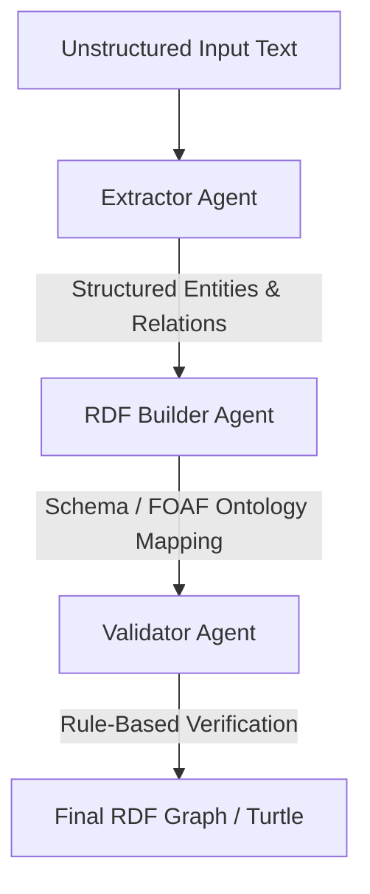

# 🌐 RDF 1.1 Package & Multi-Agent Semantic Pipeline

A fully W3C-compliant Python RDF 1.1 engine coupled with a FastAPI backend, a premium glassmorphic developer UI, and a collaborative Multi-Agent extraction pipeline powered by Gemini 2.5.

---

## 🚀 Key Features

*   **W3C RDF 1.1 Compliant Engine**: Full abstract syntax support for IRIs, Blank Nodes, and Literals. Handles N-Triples and N-Quads parsing and serialization with Unicode and escape sequence support.
*   **Graph Isomorphism**: Fast, optimized graph and dataset isomorphism checks using color-refinement hash partitioning and backtrack pruning.
*   **Pydantic Domain Model**: Rich domain objects (`RDFGraph`, `RDFDataset`, `RDFTriple`, `RDFQuad`) with automated validation and prefix-expansion capabilities.
*   **Fluent Builder API**: Highly intuitive, chainable graph construction for human-readable triples:
    ```python
    graph.person("Marie_Curie") \
         .type("Scientist") \
         .born_in("Warsaw") \
         .birth_year(1867)
    ```
*   **Multi-Agent Collaborative Pipeline**: Collaborating AI agents process unstructured text to output verified semantic graphs:
    1.  **Extractor Agent**: Extracts structured entities and relations from raw text using Gemini.
    2.  **RDF Builder Agent**: Maps raw relationships to standardized ontologies (e.g., `foaf`, `schema`, `xsd`).
    3.  **Validator Agent**: Programmatically checks for syntactic issues, duplicate triples, and namespace completeness.
*   **FastAPI & Dev Demo UI**: Beautiful, dark-themed, glassmorphic UI allowing developers to run unstructured text through the agent workflow and view Turtle outputs in real-time.

---

## 🛠️ Tech Stack

*   **Core**: Python 3.13+, RDFLib, Pydantic v2
*   **Agent Orchestration**: Gemini API, Google GenAI SDK
*   **API & Server**: FastAPI, Uvicorn
*   **Testing**: Pytest, HTTPX (async client testing)
*   **Frontend**: Vanilla HTML5, CSS3 (Glassmorphism), Vanilla JavaScript

---

## 📂 Project Structure

```
RDF_Project_v1/
├── entrypoint/
│   ├── __init__.py
│   └── server.py          # FastAPI endpoints & UI server
├── src/
│   ├── agents/            # Multi-Agent pipeline (Gemini extraction/mapping)
│   ├── app/               # Main domain models and mapping services
│   ├── rdf/               # Namespace configurations (FOAF, OWL, etc.)
│   └── rdf11/             # W3C abstract syntax and isomorphism engine
├── UIs/
│   └── index.html         # Premium Developer UI
├── tests/                 # Unit & integration test suite
└── .gitignore             # Safe environment and cache exclusions
```

---

## ⚙️ Getting Started

### 1. Prerequisites
Ensure you have Python 3.10+ installed.

### 2. Configure Environment
Create a `.env` file in the root directory (this is automatically ignored by Git):
```env
GEMINI_API_KEY=your_gemini_api_key_here
```

### 3. Run the FastAPI Server & Demo UI
Start the local server with the following command:
```bash
PYTHONPATH=src:. uvicorn entrypoint.server:app --reload --port 8000
```
Then navigate to **[http://localhost:8000/](http://localhost:8000/)** in your web browser.

### 4. Running Tests
Run the comprehensive test suite (33 passing tests) in verbose mode:
```bash
PYTHONPATH=src:. pytest -v tests/
```

---

## 🤖 Multi-Agent Workflow



### Flow Example:
*   **Input Text**: *"Marie Curie was born in Warsaw in 1867."*
*   **Output Graph (Turtle)**:
    ```turtle
    @prefix ex: <http://example.org/> .
    @prefix foaf: <http://xmlns.com/foaf/0.1/> .
    @prefix schema1: <http://schema.org/> .

    ex:Marie_Curie a foaf:Person ;
        schema1:birthDate 1867 ;
        schema1:birthPlace ex:Warsaw .

    ex:Warsaw a schema1:Place .
    ```
